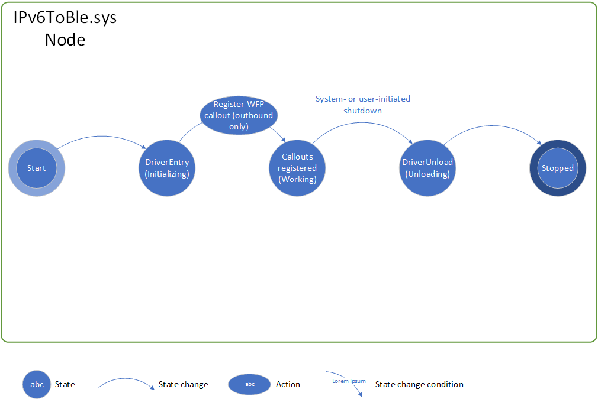

# IPv6ToBle.sys overview

This ReadMe contains important information about this driver's purpose, functionality, and naming conventions, as well as a summary of what you will find in each of the files that make up this project.

## General info

This driver is a Kernel Mode Driver Framework (KMDF)-based Windows Filtering Platform callout driver.

If you are not familiar with the concepts underlying Windows drivers in general, KMDF, or Windows Filtering Platform callout drivers, start by reading these links:

- [Concepts for all driver developers](https://docs.microsoft.com/windows-hardware/drivers/gettingstarted/concepts-and-knowledge-for-all-driver-developers)
- [Using WDF to Develop a Driver](https://docs.microsoft.com/windows-hardware/drivers/wdf/using-the-framework-to-develop-a-driver)
- [Windows Filtering Platform Callout Drivers](https://docs.microsoft.com/windows-hardware/drivers/network/windows-filtering-platform-callout-drivers2)

Use these links to learn more about the Windows Filtering Platform in general:

- [Windows Filtering Platform overview](https://msdn.microsoft.com/library/windows/desktop/aa366510)
- [Windows Filtering Platform architecture](https://msdn.microsoft.com/library/windows/desktop/aa366509)

Finally, although this driver is primarily based on KMDF, it does talk to NDIS directly at times. NDIS stands for the Network Driver Interface Specification. Although the scope of NDIS is vast, this driver mainly interacts with NDIS for working with NET_BUFFER_LIST and NET_BUFFER memory pools and converting between NET_BUFFER_LISTs and BYTE arrays.

For more information about NET_BUFFER_LIST and NET_BUFFER structures, see this link:

- [NET_BUFFER Architecture](https://docs.microsoft.com/windows-hardware/drivers/network/net-buffer-architecture)

## Purpose and supported devices

This driver's purpose is to act as part of the bridge between the Windows TCP/IP network stack and the Bluetooth stack. The other part of the bridge in this project is the user mode packet processing app, which performs IPv6 header compression/decompression and Bluetooth Low Energy API calls through the other libraries in this project.

This is a Universal Driver, meaning its INF file is universal and all system APIs called are part of Windows Onecore. It can run on either the Border Router/Gateway device or any of the mode devices within the Bluetooth Low Energy network. All Windows 10 SKUs are supported.

The *Border Router* registry key, located under this driver's main parameters key, controls the driver's behavior when it loads. When set to **1**, the driver behaves as a border router that filters inbound and outbound traffic based on the IPv6 addresses of the devices in the BLE network. When set to **0**, the driver behaves as a node device and catches all outbound IPv6/UDP traffic. To change roles without having to restart the computer, stop the driver with the **net stop ipv6toble** command, flip the key, and start the driver again with the **net start ipv6toble** command.

## Overview of functionality

The main goal of this driver is to perform IPv6 packet classification at the OSI network layer, either inbound or outbound. Inbound classification is performed on the border router/gateway device for the BLE mesh network, while outbound classification is performed both on the border router device and on the node devices.

The inbound classify function registers filters with the WFP filter engine based on the white list, so only traffic from trusted devices will be passed to the driver and thus to the rest of the mesh network. Then the function takes all packets from white-listed devices and verifies they are for one of the devices in the mesh. If they are not, the packet must be destined for the gateway and it is permitted. If it is for a mesh device, the classify function clones the packet, sends it up to usermode, and blocks the original.

On the nodes, the outbound classify function simply redirects all outbound traffic to user mode, as it is assumed the node device is either not connected to the internet, or is not meant to be. This is because all nodes within a BLE mesh subnet are isolated within the mesh for security purposes, so any reply from the node device back out would go over BLE back to the border router device and then out to the internet.

On the border router, the outbound classify function also compares to the mesh list to check if the packet is destined for a mesh device or if it is not. If the destination is on the mesh list, the function passes the packet to user mode.

A secondary goal of this driver is to re-inject packets back into the network stack upon reception from user mode. For instance, if a whitelisted external device initiates communication with a device in the mesh, the mesh device's reply would come back to the gateway device over BLE and be passed down to the driver for subsequent injection into the outbound data path. The driver can also inject packets into the inbound data path, for transmitting the IPv6 packets received over BLE to their correct application recipient.

Communication with user mode components is done with IOCTLs, or I/O Control Codes. Classification will not happen without the usermode app first having sent requests to the driver, which are queued until classification occurs and dequeued when classification is invoked. These IOCTL requests contain buffers that are used for passing the packets.

On the border router device, additional IOCTLs are used for adding and removing entries to the white list and mesh list. For performance purposes, most of the time the driver works with runtime-allocated structures in a linked list to store the white and mesh lists. One IOCTL each is defined for adding and removing from both lists.

On the border router device, the main WDFDEVICE device object also registers a timer that fires every 5 seconds. This timer's purpose is to flush the runtime lists to the registry for permanent storage in the event of unexpected shutdown or driver uninstallation. This is accomplished by queueing work items with system worker threads that run at IRQL == PASSIVE_LEVEL. The driver then checks the registry the next time it begins.

## High-level code order of operations

### Initialization

1. Create driver object
2. Create device object
3. Initialize I/O queues
4. Register callouts with the WFP filter engine (depending on state of lists)

### Running

1. Receive IOCTLs from usermode
    1. Add a listening request to a queue, to be retrieved by the classify
        callouts
    2. Inject a given packet into the TCP/IP stack (send only on border router,
        receive on both nodes and border router)
    3. Add/remove entries from the white list and mesh list (on border router)
        1. State of lists determines whether callouts are registered or
            unregistered
    4. Report the role of the device 
2. Classify network data with callouts
    1. Inbound on border router: pass packets to usermode if from white list 
        and for mesh list
    2. Outbound on border router: pass packets to usermode if from white list
        (self) and for mesh list
    3. Outbound on node device: pass all packets to usermode
3. Periodically flush white list and/or mesh list to registry (on border router)

### Unloading

1. Unregister callouts
2. Destroy the handle to the WFP filter engine
3. Destroy the runtime lists if applicable and free the NDIS memory 

The following diagram shows a simplified state machine for this driver that illustrates the general flow for running on a border router device. Note that this diagram leaves out error handling and error states.

The next diagram shows the state machine for the driver as it runs on a node device.

## Function and structure naming conventions

Functions take the following form:

Domain Subject Action [opt: Object]

All domain prefixes are "IPv6ToBle" to identify functions for this driver as
unique. All functions have a minimum of the DomainSubjectAction form except for
a few predefined functions such as DriverEntry. The subject often matches the
name of the driver module/file.

Examples of Domain Subject Action:
- IPv6ToBle Queues Initialize
- IPv6ToBle Device Cleanup

Examples of Domain Subject Action Object:
- IPv6ToBle Registry Open WhiteListKey
- IPv6ToBle Queue Inject NetworkInboundV6
- IPv6ToBle Callout Register InboundIpPacketV6Callout

Structures take the following form:

STRUCT_NAME

Example:
- WHITE_LIST_ENTRY

## SAL annotations

Almost all functions in this driver use Microsoft source-code annotation
language (SAL) in their signatures. Function declarations are annotated for
code analysis and bug detection purposes; accompanying definitions are marked
with _Use_decl_annotations_, which asserts that a function declaration is
in scope, and its annotations are to be used.

For information about SAL in Windows drivers, see this link: https://docs.microsoft.com/windows-hardware/drivers/devtest/sal-2-annotations-for-windows-drivers

## File descriptions

- IPv6ToBle.inf  
    - Driver configuration information for installation/uninstallation.
- Includes.h  
    - Header file for all includes for the project.
- Public.h  
    - Header file to be shared with applications. Contains IOCTL definitions.
- Trace.h 
    - Definitions for Windows PreProcessor (WPP) tracing for use in debugging.
- Driver.c & Driver.h  
    - *DriverEntry* and WDFDRIVER-related functionality and callbacks. Includes *DriverEntry*, the driver's entry point, DriverUnload, and WDFTIMER functionality for flushing the runtime lists to the registry.
- Device.c & Device.h  
    - WDFDEVICE related functionality and callbacks. Includes device creation.
- Queue.c & Queue.h  
    - WDFQUEUE related functionality and callbacks, including IOCTL handling. These files also contain the packet injection functions.
- Callout.c & Callout.h  
    - Windows Filtering Platform callout classify callbacks and functions to register/deregister callouts.
- RuntimeList.c & RuntimeList.h  
    - Definitions and functionality for working with the runtime lists: the trusted external device white list and the list of devices in the BLE mesh network.
- Helpers_NDIS.c & Helpers_NDIS.h  
    - Helper functions for allocating, populating, purging, and destroying NDIS memory pools.
- Helpers_NetBuffer.c & Helpers_NetBuffer.h  
    - Helper functions for converting packets between kernel mode NET_BUFFER_LIST structures and user mode byte arrays.
- Helpers_Registry.c & Helpers_Registry.h  
    - Helper functions for working with the registry, including opening/creating keys, loading list info from the registry, and flushing runtime lists to the registry.