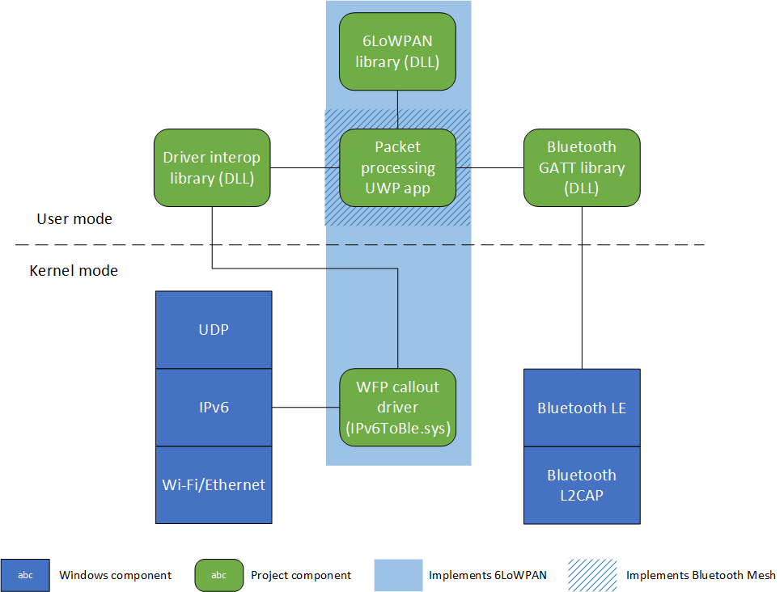

# IPv6OverBluetoothLowEnergyMesh

This project enables the transfer of IPv6 packets over a Bluetooth Low Energy (BLE) mesh of IoT devices, using Windows 10 as the platform. It implements elements of the Bluetooth Mesh profile and conforms to specifications for IPv6 over Low-power Personal Area Network (6LoWPAN) functionality. By doing so, this project permits the transfer of standard Internet traffic to low-power nodes in an IoT network, opening possibilities for communication with such devices remotely.

## Architecture

There are two primary components to this project:

1. WFP callout driver (IPv6ToBle.sys)
2. Packet processing app

Additionally, there are four DLL libraries in this project to support functionality in the packet processing app:

1. A custom driver interoperability library
2. A Bluetooth GATT library, also including device enumeration and discovery
3. A Bluetooth Advertisement library*
4. A 6LoWPAN library

*Unused in final implementation, but available for completeness and future customization

The following diagram illustrates the system architectue for this solution:

## System requirements

This project requires Windows 10, version 1709 minimum. All components are Universal and will run on any Windows 10 SKU, as they only call APIs from Windows Onecore libraries. The WFP callout driver is unique to Windows and does not translate directly to other platforms architecturally.

Porting this project to Linux/Unix is possible by not using the driver, then using socket programming in the user mode packet processing app to perform send and receive operations for UDP IPv6 packets. However, although the basic logic of the packet processing app can be ported, two critical aspects rely on Windows-specific APIs: device enumeration/discovery over Bluetooth LE, and the Bluetooth LE APIs themselves. Equivalent functionality would have to be found in other libraries to replicate this code on other platforms.

## Components

### WFP callout driver

This Windows Filtering Platform callout driver acts as part of the bridge between the TCP/IP stack on Windows and the Bluetooth stack. The driver's binary is IPv6ToBle.sys. The driver is designed to either filter traffic destined for a device in the BLE network, if it is running on a border router device, or it is designed to catch all outbound traffic for the nodes running in the BLE network.

**Note** Source code for this project is best viewed in Visual Studio, as line endings and indentation are sometimes thrown off by Git converting line endings if you view it in the browser.

For detailed information about this driver, see the ReadMe.md file in the `IPv6ToBle.sys` directory.

### Packet processing app

The packet processing app is the core user mode component that completes the bridge between the TCP/IP network stack and the Bluetooth LE stack. It performs the following functions:

- Talks to the 6LoWPAN library to obtain a link-local IPv6 address based on the local Bluetooth radio address
- Scans for nearby Bluetooth LE devices, then filter them for compatibility if they are running this project's GATT server services
- Speaks with the driver through the driver interop library to receive IPv6 packets asynchronously
- Compresses the IPv6 header of packets received from the driver by calling into the 6LoWPAN module
- Transfers the packet over BLE to nearby compatible devices
- On the other side of the BLE link, the same app is running and receives the packet over BLE
- If the packet is for that device, it sends it to the driver for inbound injection into the TCP/IP network stack
- If the packet is not for the device, it re-sends the packet out over BLE to each nearby device

A message queue is used to monitor if messages have been seen before and prevent unnecessary retransmissions.

For detailed information about this app, see the ReadMe.md file in the `PacketProcessing` directory.

### Driver interop library

This library, based on two MSDN magazine articles by Jeffrey Richter in March 2007 and June 2007, is what the packet processing app calls to talk to the driver. It supports synchronous commands, for manipulating the driver's lists of devices for filtering traffic, and asynchronous commands backed by the system thread pool to receive IPv6 packets from the driver.

For detailed information about this library, see the ReadMe.md file in the `Libraries/DriverInteropLibrary` directory.

### Bluetooth GATT library

This library, based on the Microsoft *BluetoothLE* and *BluetoothLE Explorer* samples, encompasses GATT server and client functionality.

The GATT server advertises two services:

1. The Bluetooth SIG-defined Internet Protocol Support Service (IPSS), which informs querying devices that this device supports IPv6 packet transfer
2. A custom IPv6ToBlePacketProcessingService, which contains one characteristic that provides the device's link-local IPv6 address (generated by the 6LoWPAN library), as well as a second characteristic that receives a packet over the air

GATT client code uses the Windows DeviceWatcher class to scan for nearby BLE devices, queries them for the previously mentioned GATT server services, and writes packets to nearby supported devices when a packet is received either from the driver or over the air.

For detailed information about this library, see the ReadMe.md file in the `Libraries/Bluetooth/IPv6ToBleBluetoothGattLibrary` directory.

### Bluetooth Advertisement library

This library, based on the Microsoft *BluetoothAdvertisement* sample, uses a Bluetooth Publisher and Watcher to advertise the presence of a supported BLE device. This library was not used in the final product due to conflicts with simultaneous GATT server advertisements, but it is left in for completeness and for future customization in case someone might want to send data with Advertisements instead of with GATT. It should be noted, though, that Bluetooth advertisements are limited to 20 bytes per packet, and transferring data this way would require manual fragmentation and reassembly that is normally automatic with Windows GATT APIs.

### 6LoWPAN library

6LoWPAN has three defined goals per RFC 6282:

1. Header compression
2. Fragmentation and reassembly
3. Stateless auto configuration

This library fulfills the first and third goals; the second goal is automatically performed at the Bluetooth L2CAP layer by the Windows Bluetooth LE APIs.

It is important to observe that this code is implemented as a library, not as an operating system layer or module. In open source operating systems such as Contiki OS, on which the header compression/decompression code was based for this library, 6LoWPAn is implemented as an adaptation layer in the network stack. This is not possible on Windows because it is closed source. Therefore, the *concept* of an adaptation layer is spread across the driver and this module, as shown in the system architecture diagram above. The *implementation* for 6LoWPAn itself lies here, though.

For detailed information about this library, see the ReadMe.md file in the `Libraries/IPv6ToBleSixLowPanLibrary` directory.

### Additional test apps

In the `TestApps` directory are several apps used for testing during development:

1. DriverTest
    1. This app contains buttons to test the various IOCTL commands that the driver supports. You can also use this app to test performance of the driver by customizing how many listening requests to send at a time, and how many test UDP packets to send at a time.
2. IPv6AddressPrinterForIoTCore
    1. This app is a simple app that prints out a device's generated link-local IPv6 address that is based on its Bluetooth radio ID.
3. IPv6ToBlePacketProcessingForDesktop
    1. An experimental Windows Service to run in the background on a Windows Desktop (x86/x64) border router device. Incomplete.
4. IPv6ToBlePacketProcessingForIoTCore
    1. Nearly identical to the main PacketProcessingTestUWP app, but designed to run in the background on a Windows 10 IoT core device such as a Raspberry Pi 3. Unused due to limitations of performing device discovery scans from a background thread. Requires modification to perform device enumeration in the background properly.

## Installation

In its current form, this project requires a specific test environment to run. You must install both the Windows SDK and the Windows Driver Kit, or WDK, on your primary PC. The version of the SDK/WDK used during development was for Windows 10, version 1709, or build 16299. This is the version of the libraries against which the driver is linked, so it's probably easiest to download and install those versions. If you use a newer version, you'll have to update the linker paths for the libraries in the driver project settings.

Running this project also requires Visual Studio 2017.

### Deploy and install the driver on a VM

There are two important things to note for IPv6ToBle.sys.

First, it is not a production signed driver. Driver signing is a complex process that requires extensive testing and costly certification, usually reserved for businesses. Furthermore, this driver might still change under continued development, and changes/updates to publicly published production drivers are more difficult and time consuming. For more information about the driver installation, signing, and updating process, see [Device and Driver Installation fundamental Topics](https://docs.microsoft.com/windows-hardware/drivers/install/device-and-driver-installation-fundamental-topics).

Second, as IPv6ToBle.sys is a kernel mode driver, the possibility still exists for errors to occur that crash the system on which it is running. Core scenarios of IOCTL interaction such as filter list manipulation, packet interception, and returning packets to the user mode app have all been tested and validated, but the possiblity of bugs lurking in the code is still there. Therefore, it is advised to run the driver on a virtual machine. It is not a requirement, but it is recommended.

With these notes in mind, these instructions will assume you are running the driver and packet processing app in an x64-based Windows virtual machine. Set up your VM before starting these steps.

1. Start by provisioning the virtual machine with the steps on [Provision a computer for driver deployment and testing (WDK 10)](https://docs.microsoft.com/windows-hardware/drivers/gettingstarted/provision-a-target-computer-wdk-8-1). They should work for a virtual machine such as one running in Oracle VirtualBox, which is what was used during development. If the automatic provisioning steps do not work, try the manual steps described in [Debug Universal Drivers - Step by Step Lab (Echo Kernel-Mode)](https://docs.microsoft.com/windows-hardware/drivers/debugger/debug-universal-drivers---step-by-step-lab--echo-kernel-mode-). Look in Section 1 for how to manually set up a computer (or VM) for driver deployment and testing.

    These tips might help you, too (these are the steps followed during development).

    1. Set up a second network adapter on the VM: one that is a bridged adapter (for Internet access), and one host-only adapter.
    2. Assign a static IP address to your PC's network adapter and to the VM's host-only network adapter.
    3. Configure inbound firewall rules for both the host and the VM to allow the other through. Make sure they can ping each other.
    4. Set up a shared folder by using whatever tool is provided by the VM software maker.
    5. Use the shared folder to transfer the **WDK Test Target Setup x64_en-us** file located in this directory of the host PC: `C:\Program Files (x86)\Windows Kits\10\Remote\x64` to the target VM PC.
    6. Install the test target setup program on the VM/target PC.
    7. Run `services.msc` and make sure the WDK test service is running. This is so someone is listening on the correct port when Visual Studio tries to provision the VM.
    8. Follow the steps on the above linked page to provision the VM with Visual Studio. It should reboot into a "WDKRemoteUser" account with a "Test Mode" watermark stamp in the bottom right of the screen. Use network provisioning with the static IP address you assigned to the host network adapter earlier. You might also need to acquire the Bus Parameters for the target PC's host-only network adapter. You can get that information in Device Manager on the test VM in the host-only network adapter's properties.

2. After provisioning the target PC correctly, go to `Build > Deploy Solution` in Visual Studio with Debug | x64 selected in the Configuration Manager. You should see command prompt windows pop up on the VM. Visual Studio will tell you in the output when deployment succeeds.
3. The driver files are deployed to the `C:\DriverTest\Drivers` directory on the VM. Right-click the IPv6ToBle.inf (Setup Information) file, then click **Install**.
4. To run the driver, open an elevated command prompt window and type `net start ipv6toble`. To stop the driver, type `net stop ipv6toble`.

**Important** The driver is configured to behave differently depending on whether it is running on a border router device or not. For testing purposes, leave it as a non-border router (the default). That will cause it to catch all outbound traffic that is IPv6/UDP and will let you test the system. To change the registry key, open Regedit.exe and navigate to `Computer\HKEY_LOCAL_MACHINE\SYSTEM\ControlSet001\Services\IPv6ToBle\Parameters`. Change the *Border Router* flag to 1 if you'd like to experiment with filter list operations with the DriverTest app.

### Deploy and install the driver on an IoT Core device (OPTIONAL)

The steps above are for deploying and running the driver on a Windows Desktop SKU device (laptop or desktop, x86 or x64). Technically, the driver can also run on the IoT Core devices if it is compiled for ARM or whatever processor your board has. It is Universal and has been tested to work on IoT devices. However, deploying and properly installing the driver onto an IoT Core device is more complicated than the process to deploy to a standard x64 or x86 PC. The steps on this page describe how to do so: [Driver deployment](https://docs.microsoft.com/windows/iot-core/learn-about-hardware/driverdeployment). The package file described on that page is already created in the driver source directory, so if you provision the IoT core device properly then you just have to add that file to the project and deploy it. Make sure you remove the file from the project (but don't delete it) if you want to switch to x64 again.

Post-deployment installation usually fails and requires a manual PowerShell session to work around the issue. Follow these steps if you are able to deploy the driver, but not install it. For example, if you get a CBS error during deployment, that means the driver files were deployed but they were not installed properly.

1. Follow the steps on this page if you're unfamiliar with how to connect to a Windows 10 IoT Core device remotely with PowerShell: [Using PowerShell for Windows IoT](https://docs.microsoft.com/windows/iot-core/connect-your-device/powershell).
2. With PowerShell, change to the directory where the driver files are located: `cd c:\data\test\bin\drivertest\driversnew`.
3. Apply the update with this command: `Applyupdate -stage duncanmacmichael.drivers.ipv6toble.cab`.
4. Commit the update with this command: `Applyupdate -commit`.

The Raspberry Pi/IoT device should restart, then you should see the spinning gears that means it is applying the driver to the board image. The driver is configured to auto-start when the system boots, so it will be running the next time the IoT device boots.

If you encounter an issue when committing the update, clear the update cache first by using this command: `Applyupdate -clear`. Then try applying the update again.

**Note** If you make a change to the driver, re-compile, and re-deploy to an IoT device, you must also bump the version number in the project properties > PackageGen.

It is notable that, at the time of writing, the Windows 10, version 1803 version of the WDK contains a bug that prevents provisioning IoT Core devices for driver deployment. The Windows 10, version 1709 version of the WDK was used for development because it did not have this bug.

### See trace output from the driver (OPTIONAL)

If you'd like to see what the driver is doing as it operates, use Traceview.exe.

1. On the host PC, it's located in the `C:\Program Files (x86)\Windows Kits\10\Tools\x64` directory. Use the shared folder setup with your VM to transfer it to the VM. 
2. Locate the driver's program database (PDB) file in the `IPv6ToBle.sys/x64/Debug` directory of this project. If it's not there, go to `Build > Build full program database file for solution`. Transfer it to the VM as well.
3. Start TraceView.exe on the VM, right-click and select "Start New Log Session."
4. Click "Add Provider," then choose "PDB (Debug Information)" file. Click the ellipsis (...) and choose the driver's PDB file. Click OK.
5. When you hit "Next," choose "Set Flags and Level" on the next pane. Double-click "Level," then pick the level of output you want to see.
    1. For output of every single operation the driver does, choose the Information level.
    2. To only see non-critical warnings, choose the Warning level.
    3. To see only critical errors, choose the Error level.

If you do this before starting the driver, you can see what it does as it starts up. Otherwise, if the driver is already running, TraceView will just start showing what the driver is doing at the moment. If you interact with the driver by using the DriverTest app or by using the packet processing app, you can watch the output illustrate the steps the driver is taking.

Try experimenting with the DriverTest app to exercise the driver's capabilities. Change the *Border Router* registry key (described above) to **1**, then try the commands to manipulate the white list and mesh list. You can see it working by watching the output and examining the child keys under the main parameters key.

### Configure the Raspberry Pi 3s/IoT node devices

This project was tested using two Raspberry Pi 3 devices as nodes in the BLE network, both running Windows 10 IoT Core.

1. Use the [Windows 10 IoT Downloads](https://developer.microsoft.com/en-us/windows/iot/downloads) page to download the Windows 10 IoT Core Dashboard app, then use the app to flash the Windows 10 IoT Core image onto the Raspberry Pis' SD cards.
2. After going through the OOBE, note the Pi's IP address.

### Deploy the packet processing app to the desktop

1. Open the PacketProcessing app.
2. In the project properties, go to Debug and enter the VM/target PC's IP address in the Remote Machine field.
3. Press **F5** or go to `Debug > Start Debugging` to deploy the app to the VM.
4. Make sure the driver is running.

Don't start this app yet. You'll start the apps on the IoT devices first, then start this one last.

### Deploy the packet processing app to IoT Core Node 1

Open the PacketProcessing_Node_1 app, which is identical to the main PacketProcessing app except that certain blocks of code are commented out. On the desktop, code for the GATT server is commented out because the Bluetooth dongle used in development did not support being a GATT server. On the node devices (Raspberry Pi), the GATT code is uncommented but the driver code is commented out.

1. Open the PacketProcessing_Node_1 app.
2. In the project properties, go to Debug and enter Node 1's IP address in the Remote Machine field.
3. Press **F5** or go to `Debug > Start Debugging` to deploy the app to the device.

Don't start this app yet, either.

### Deploy the packet processing app to Iot Core Node 2

1. Open the PacketProcessing_Node_2 app.
2. In the project properties, go to Debug and enter Node 2's IP address in the Remote Machine field.
3. Press **F5** or go to `Debug > Start Debugging` to deploy the app to the device.

## Usage

With the driver running on the VM and the packet processing apps running on all three devices, now you can test the system.

1. Click "Start" on the packet processing app on Node 2. It will scan for nearby devies and find no one, which is expected. It then starts the GATT server and starts advertising its presence.
2. Click "Start" on the packet processing app on Node 1. It will scan and find Node 2, then query it to make sure it is supported. You should see "Found 1 devices" in the debug output if successful. It then starts the GATT server.
3. Start the packet processing app on the VM. It will scan for and find both Nodes. You should see "Found 2 devices" in the debug output if successful.
4. Now, you can either use the DriverTest app on the VM to send some packets to the driver that will be intercepted and passed to the packet processing app, or you can just wait. After anywhere from a few seconds to a minute, the driver will always intercept an outbound packet that the OS randomly generates.
5. Once the driver has passed a packet to the packet processing app on the VM, you should see that it sends the packet to each of the nodes in turn after showing the contents of the packet. When once of the nodes receives a packet, you'll see the packet contents in the debug output of that node. Node 1 should then turn around and send the packet to Node 2, which will show that it received the packet from both Node 1 and the VM. The second time it receives a packet, it will discard it as a duplicate.

If you encounter errors during this process, you might have to restart the devices and redeploy the apps. The Bluetooth LE driver on Raspberry Pi 3 devices is not always reliable in establishing repeated communications, and might error out after several attempts or even during the scanning stage.